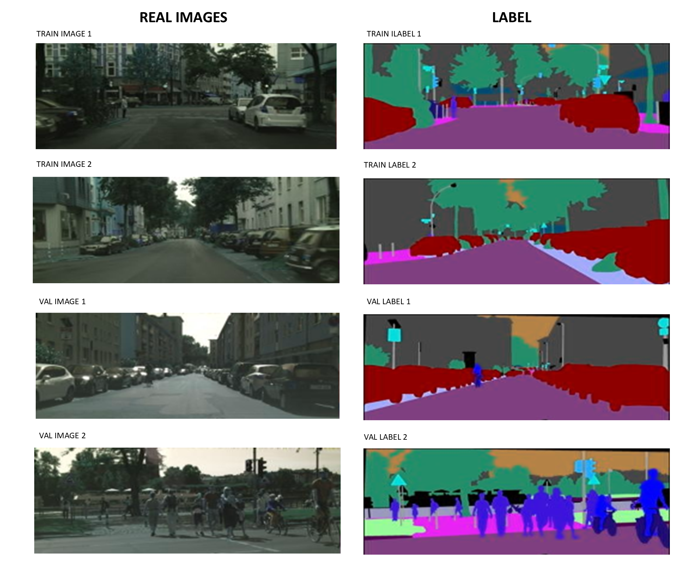
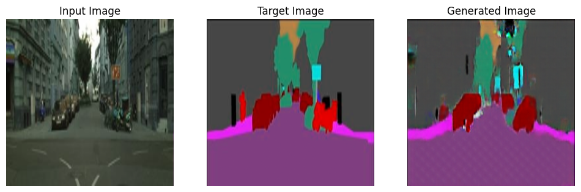

# Pix2Pix Cityscapes

**Pix2Pix implementation for translating semantic labels into photorealistic street scenes using the Cityscapes dataset.**

This repository contains a **Conditional GAN (Pix2Pix)** project for **paired image-to-image translation**. The model is trained to map **semantic label maps** (like roads, cars, buildings) to **realistic urban street images** from the Cityscapes dataset.

---

## Dataset Samples

Here are some example pairs from the dataset.  
The first image shows **training samples**, the second shows **validation samples**.

  
*This slide contains 2 training and 2 validation label → real image pairs.*

---

## Sample Model Output

Here is a sample output from the Conditional GAN (Pix2Pix):

  
*Shows Input Label → Generated Image → Real Image.*

---

## Notes

- Only a small number of samples are included for demonstration purposes.  
- The full Cityscapes dataset can be downloaded [here](https://www.cityscapes-dataset.com/).  
- The model uses a **U-Net generator** and **PatchGAN discriminator** for high-quality image-to-image translation.  
